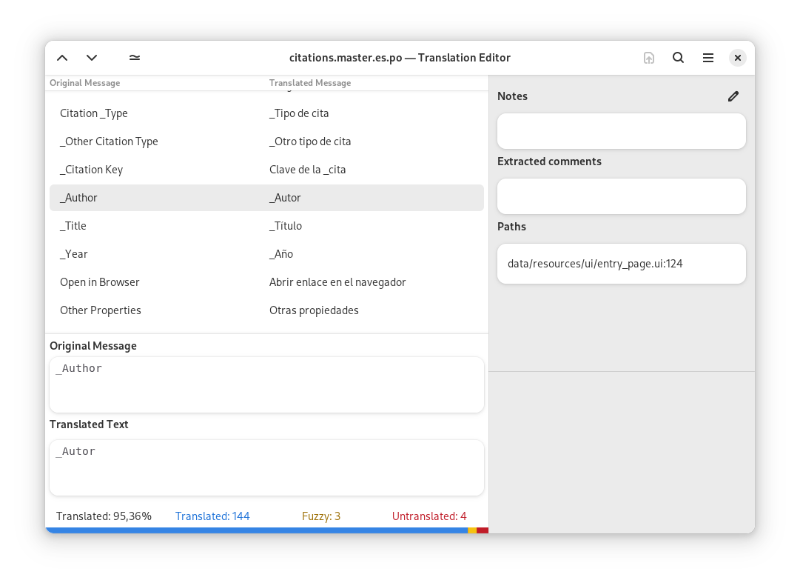

<a href="https://flathub.org/apps/details/org.gnome.Gtranslator">

</a>

# Gtranslator (-the GNOME translation making program-)

<p>Translate apps in your language</p>

Gtranslator is an enhanced gettext po file editor for the GNOME desktop
environment. It handles all forms of gettext po files and includes very useful
features like find/replace, translation memory, different translator profiles,
messages table (for having an overview of the translations/messages in the po
file), easy navigation and editing of translation messages and comments of the
translation where accurate.

You can check for the latest news and releases on the gtranslator Gitlab repository:

>   https://gitlab.gnome.org/GNOME/gtranslator/

In the case you found a bug or wanted to give us a "wish-feature" of your own,
please file a report under the gtranslator product in GNOME gitlab at:

>   https://gitlab.gnome.org/GNOME/gtranslator/issues/

If you have got any problems, need support, want to give any ideas, hints,
blame us, spam us or declare your love to gtranslator you can do this via the
GNOME support forum:

>   https://discourse.gnome.org/c/applications/

We've also a Matrix channel, you can contact us directly in the #gtranslator:gnome.org channel:

>   https://matrix.to/#/#gtranslator:gnome.org

Please don't hesitate to file bug reports on
https://gitlab.gnome.org/GNOME/gtranslator/issues/ or to share your comments,
ideas, suggestions with us on our mailing list - we do really, really, really
appreciate any kind of feedback and user comments very much in the
community/gtranslator field :-)

## Screenshots

<div align="center">

</div>

## How to build

If you get this code from the git repository the easier way to build is using
gnome-builder. There's a flatpak manifest that gnome-builder uses to build all
deps and launch the application sandboxed so you don't need to worry about
dependencies.

If you want to build by hand, you should follow the meson build commands:

```
meson _build
ninja -C _build
ninja -C _build install
```

## Translations

Helping to translate Gtranslator or add support to a new language is very
welcome. You can find everything you need at:
[l10n.gnome.org/module/gtranslator/](https://l10n.gnome.org/module/gtranslator/)

## Code Of Conduct

This project follows the [GNOME Code of Conduct](https://conduct.gnome.org/).
